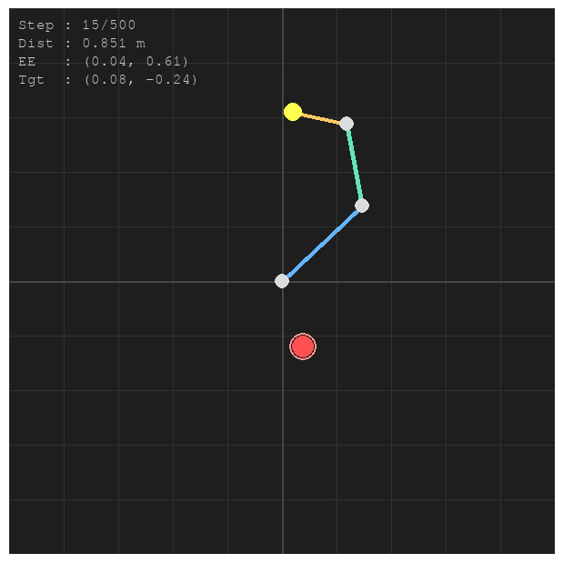

# 🤖 Planar Robot 3-DOF — Gymnasium RL Environment

A custom [Gymnasium](https://gymnasium.farama.org/) environment for a **3-DOF planar robot arm** that learns to reach a target position using Reinforcement Learning.


---

## 📸 Preview



> *Blue link = Joint 1 (0.4m) · Green link = Joint 2 (0.3m) · Yellow link = Joint 3 (0.2m)*
> *Red circle = Target · Yellow dot = End-effector*

---

## ✨ Features

- ✅ Fully compatible with **Gymnasium API** (v1.x — new `terminated/truncated` convention)
- ✅ Continuous observation & action spaces (ready for SAC, TD3, PPO)
- ✅ **Dense + sparse reward shaping** for efficient learning
- ✅ Planar **forward kinematics** implementation
- ✅ Pygame **2D rendering** with HUD (step, distance, positions)
- ✅ Configurable link lengths, joint limits, goal threshold, dt
- ✅ `check_env()` validated ✓

---

## 📦 Installation

### Option 1 — Install as package (recommended)

```bash
git clone https://github.com/rifkyafriza/planar-robot-rl.git
cd planar-robot-rl

pip install -e .
```

For training with Stable-Baselines3:

```bash
pip install -e ".[train]"
```

For everything (train + dev):

```bash
pip install -e ".[all]"
```

### Option 2 — Install requirements directly

```bash
pip install -r requirements.txt
```

---

## 🚀 Quick Start

### Basic usage

```python
from envs import PlanarRobot3DOFEnv

env = PlanarRobot3DOFEnv()
obs, info = env.reset(seed=42)

for _ in range(500):
    action = env.action_space.sample()          # random policy
    obs, reward, terminated, truncated, info = env.step(action)
    if terminated or truncated:
        obs, info = env.reset()

env.close()
```

### With rendering

```python
env = PlanarRobot3DOFEnv(render_mode="human")
obs, info = env.reset()

for _ in range(500):
    action = env.action_space.sample()
    obs, reward, terminated, truncated, info = env.step(action)
    if terminated or truncated:
        obs, info = env.reset()

env.close()
```

### Validate environment

```python
from gymnasium.utils.env_checker import check_env
from envs import PlanarRobot3DOFEnv

check_env(PlanarRobot3DOFEnv())
print("✅ Environment valid!")
```

---

## 🏋️ Training

Train using [Stable-Baselines3](https://stable-baselines3.readthedocs.io/):

```bash
# SAC (recommended for robot control)
python train.py --algo sac --timesteps 500000

# TD3 (deterministic continuous control)
python train.py --algo td3 --timesteps 500000

# PPO (on-policy, good baseline)
python train.py --algo ppo --timesteps 1000000

# Train + visualize
python train.py --algo sac --timesteps 500000 --render
```

### Monitor with TensorBoard

```bash
tensorboard --logdir tb_logs/
```

---

## 📊 Evaluate

```bash
python evaluate.py --model models/planar_robot_sac --episodes 20 --render
```

---

## 🧠 Environment Details

### Observation Space — `Box(8,)` float32

| Index | Description | Range |
|-------|-------------|-------|
| 0–2   | Joint angles θ₁, θ₂, θ₃ | `[-π, π]` rad |
| 3–5   | Joint angular velocities | `[-2, 2]` rad/s |
| 6–7   | Target position (x, y) | `[-0.9, 0.9]` m |

### Action Space — `Box(3,)` float32

Normalized torque/angular velocity per joint: `[-1.0, 1.0]`

### Reward Function

```
reward = (prev_dist - curr_dist)          # dense: closing in on target
       + 10.0  [if dist < threshold]      # sparse: reached target!
       - 0.1 × joint_limit_violations     # penalty: joint at limit
       - 0.001 × ||action||²              # penalty: smooth control
```

### Forward Kinematics (Planar 3-DOF)

```
x = l₁·cos(θ₁) + l₂·cos(θ₁+θ₂) + l₃·cos(θ₁+θ₂+θ₃)
y = l₁·sin(θ₁) + l₂·sin(θ₁+θ₂) + l₃·sin(θ₁+θ₂+θ₃)
```

### Default Parameters

| Parameter | Value | Description |
|-----------|-------|-------------|
| `link_lengths` | `(0.4, 0.3, 0.2)` m | Length of each link |
| `goal_threshold` | `0.05` m | Distance to consider "reached" |
| `dt` | `0.05` s | Simulation timestep |
| `max_angular_vel` | `2.0` rad/s | Max joint speed |
| `joint_limit` | `π` rad | Joint angle limit |
| `max_episode_steps` | `500` | Steps per episode |

---

## 📁 Project Structure

```
planar-robot-rl/
├── envs/
│   ├── __init__.py
│   └── planar_robot.py     ← Main environment class
├── assets/
│   └── preview.png         ← Preview image
├── models/                 ← Saved models (gitignored)
├── tb_logs/                ← TensorBoard logs (gitignored)
├── train.py                ← Training script (SB3)
├── evaluate.py             ← Evaluation & metrics script
├── requirements.txt
├── pyproject.toml
├── LICENSE
└── README.md
```

---

## 🔧 Algorithm Guide

| Algorithm | Best For | Notes |
|-----------|----------|-------|
| **SAC** | Robot continuous control | Sample efficient, entropy regularization |
| **TD3** | Deterministic control | Twin critics, delayed policy update |
| **PPO** | Baseline / prototyping | On-policy, stable, forgiving hyperparams |

---

## 📄 License

MIT © [Rifky Afriza](https://github.com/rifkyafriza)
